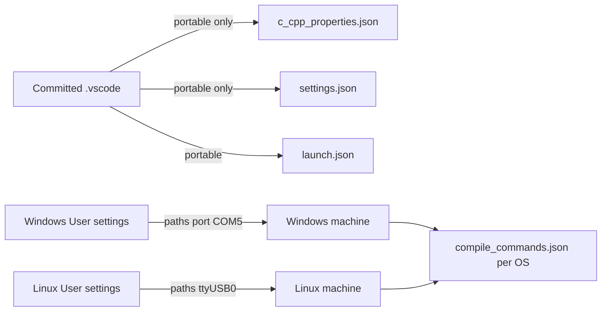

# VSCode Cross-Platform (Windows + Linux) Setup Plan

## Goal
Make the `.vscode` configuration work on both Windows (current hardcoded setup)
and Linux (this workspace), without duplicating broken machine-specific paths
in the repo, and without breaking the existing Windows environment.

## Current problems
| File | Problem |
|------|---------|
| `.vscode/c_cpp_properties.json` | `compilerPath` hardcoded to Windows `gcc.exe` |
| `.vscode/settings.json` | `idf.espIdfPath`, `idf.toolsPath`, `idf.pythonBinPath`, `idf.portWin`, `clangd.path` — all Windows-only |
| `.vscode/settings.json` | `clangd.arguments --compile-commands-dir=d:\Projects\Espressif\Clock\clock\build` — points to a *different* project on Windows (broken) |

## How the split works

VSCode resolves settings by **scope**, not by OS. There is no per-OS block in
`settings.json`. Therefore:

- **Repo (committed `.vscode`)** keeps only portable, platform-agnostic settings.
- **Per-machine (global "User settings")** keeps all absolute paths, serial
  port, and tool binaries. These are generated per machine by the ESP-IDF
  extension wizard (`ESP-IDF: Configure ESP-IDF extension`).

## Decisions to confirm
1. **Language server**: standardize on **clangd** (recommended; project already
   has `.clangd` and ESP-IDF uses clangd natively) vs keep Microsoft C/C++
   IntelliSense. This changes which keys remain in the committed settings.
2. **Per-machine storage**: global **User settings + wizard** (recommended)
   vs committing `*.example.json` files for each OS vs a gitignored local file
   (VSCode has no native merge for a local settings file).
3. Whether to also upgrade `launch.json` with a real ESP-IDF OpenOCD+gdb debug
   configuration (optional, portable via `idf.*` config vars).

## Concrete Linux values (this machine, for the doc)
- `idf.espIdfPath`: `/home/yevstigneyevda/esp/esp-idf/v6.0.2`
- `idf.toolsPath`: `/home/yevstigneyevda/.espressif`
- `idf.pythonBinPath`: `/home/yevstigneyevda/.espressif/python_env/idf6.2_py3.12_env/bin/python`
- `idf.port`: `/dev/ttyUSB0` (verify with `ls /dev/ttyUSB*` / `dmesg`)
- `clangd.path`: `/home/yevstigneyevda/.espressif/tools/esp-clangd/esp-21.1.3_20260408/esp-clangd/bin/clangd`
- `idf.customExtraPaths`: generated by the wizard / `export.sh` (auto-detected)

## Deliverables
1. Portable `c_cpp_properties.json` (drop `compilerPath`, keep `compileCommands`).
2. Trimmed portable `settings.json` + fixed `clangd.arguments`.
3. `docs/vscode-setup.md` with the scope-split principle, wizard workflow, and
   Windows + Linux User-settings blocks.
4. README/README_ru pointer to the new doc (optional).
5. Optional: real `launch.json` ESP-IDF debug config.
